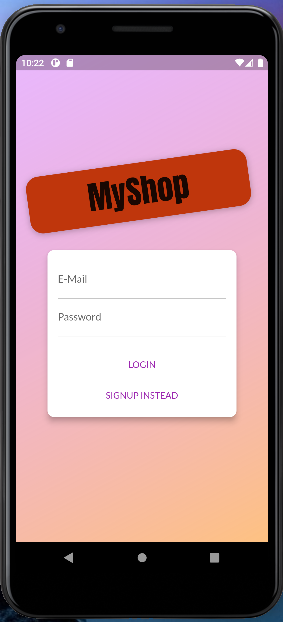
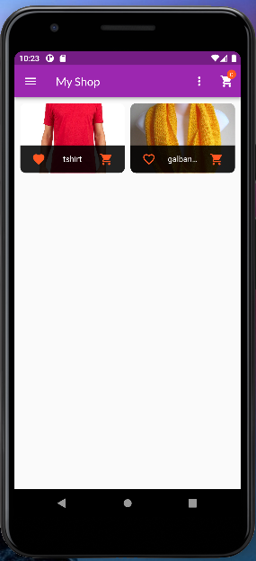
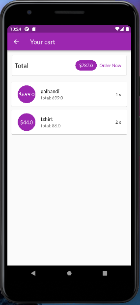
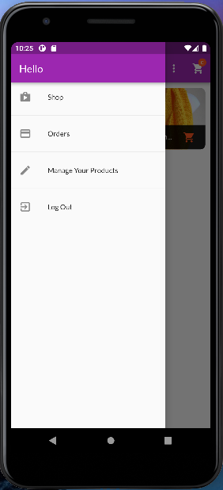
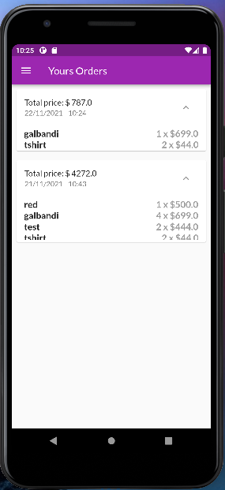
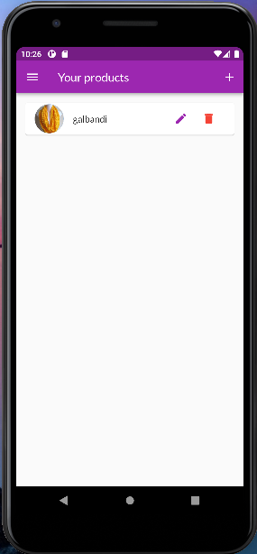
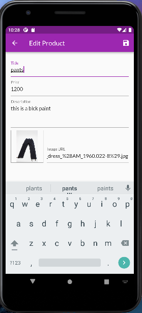

# Shop (simple e-commerce app)
Shop app have following featurs:
1. users can add, delete and edit products to the main page of the app.
2. user can order the product.
3. user can set favorites to products.
4. user can login and logout.

# [Test this in web](https://subash9860.github.io/shop_app/#/)

## Getting Started
```
git clone git@github.com:subash9860/shop_app.git
cd shop_app
code .
flutter pub get
```
then debug it.

### Whats implemented

- Firebase authentication
- Firebase realTime database
- Provider package for state management
- Navigation push/pop to show details page
- Stateless & Stateful Widgets
- Custom widgets for list items, category items,  map, etc.
- UI/UX

# Some Snapshot
  
  
 

# Thank You for visiting.